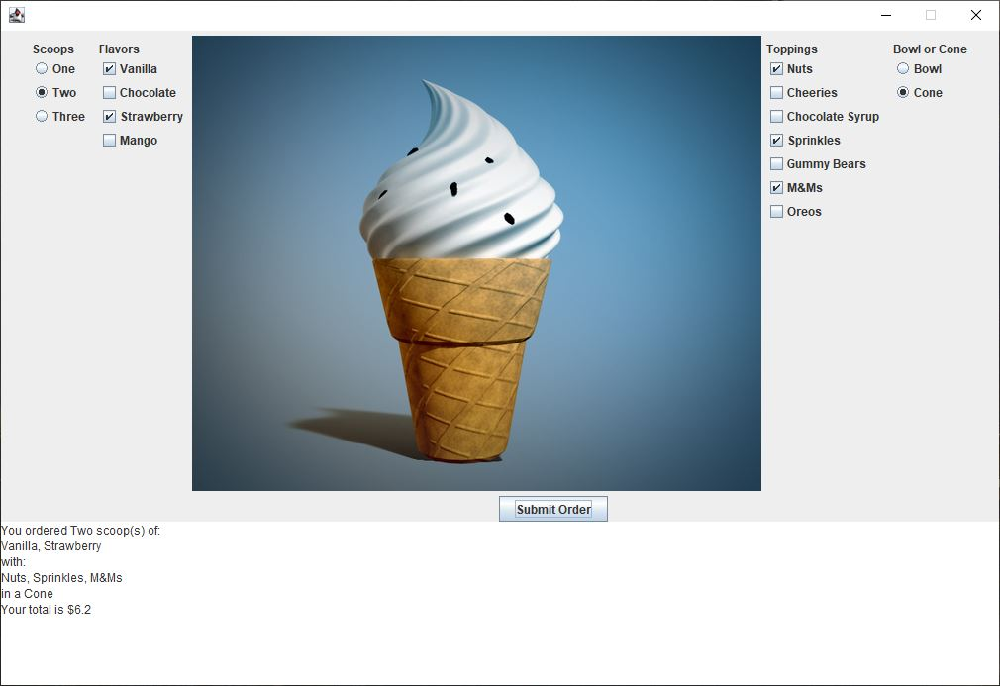

# lab-6

## an Ice Cream shop

In this program, we will work together in class and the lab to create an Ice Cream shop using the Java programming language. We will learn various components which make up a small GUI application.

This small GUI program will require the following classes:

- IceCreamShopTesting: will contain the main function and object of the IceCreamShop class.
- IceCreamShop: will extend `JFrame` and implement the `ActionListener` interface to activate the Submit button to generate an even upon pressing. As a result the IceCreamShop will display a customer order.
- InputPanel: will contain the objects of the toppings panel, flavors panel, scoops panel and the ice cream holder (cup or cone) panel.
- ToppingPanel: will manage toppings
- FlavorsPanel: will manage flavors
- ScoopsPanel: will manage Scoops
- HolderPanel: will manage the container to hold ice cream
- OutputPanel: will contain the TextArea to display the final order

Sample Run

## Compile and Run

### IceCreamShopTesting

    javac IceCreamShopTesting.java
    java IceCreamShopTesting
